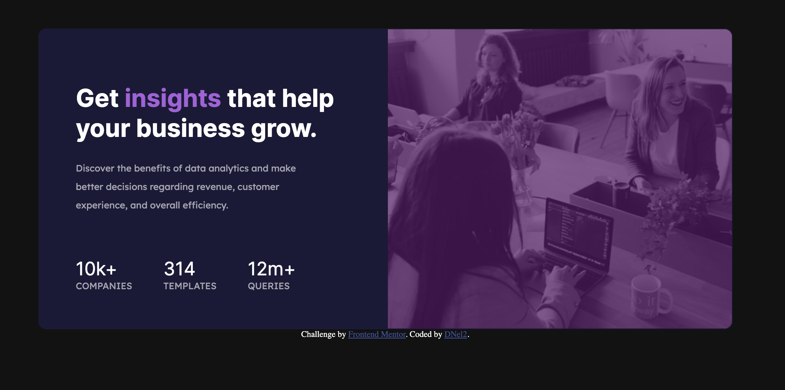

# Frontend Mentor - Stats preview card component solution

This is a solution to the [Stats preview card component challenge on Frontend Mentor](https://www.frontendmentor.io/challenges/stats-preview-card-component-8JqbgoU62). Frontend Mentor challenges help you improve your coding skills by building realistic projects. 

## Table of contents

- [Overview](#overview)
  - [The challenge](#the-challenge)
  - [Screenshot](#screenshot)
  - [Links](#links)
- [My process](#my-process)
  - [Built with](#built-with)
  - [What I learned](#what-i-learned)
  - [Continued development](#continued-development)
  - [Useful resources](#useful-resources)
- [Author](#author)
- [Acknowledgments](#acknowledgments)

**Note: Delete this note and update the table of contents based on what sections you keep.**

## Overview

### The challenge

Users should be able to:

- View the optimal layout depending on their device's screen size

### Screenshot

### Links

- Solution URL: [Add solution URL here](https://your-solution-url.com)
- Live Site URL: [Add live site URL here](https://your-live-site-url.com)

## My process

My current process is to look at the final product and map out the divisions and elements. I take that information and create the HTML. After that step, I move on to the CSS for desktop and then add a media query for mobile.

### Built with

- HTML
- Basic CSS
- Flexbox

### Continued development

I am new to website development, so I am hoping to get better at my workflow and general knowledge. I feel like this project required me to do a lot of little tweeks to values to make everything function, so it isn't as clean as it could be. I hope that as I learn more, I will figure out what are the best practices to follow. 

### Useful resources

- [Flexbox Help](https://css-tricks.com/snippets/css/a-guide-to-flexbox/) - This helped me with flexbox. I am sure everyone already uses this website. 
- [iEatWebsites] (https://youtu.be/uLvhAJfx3T0) - Simple CSS Color Overlay For Background Images
## Author

- Website - [D Nelson 2](TBD)
- Frontend Mentor - [@TechEdDan2](https://www.frontendmentor.io/profile/TechEdDan2)

## Acknowledgments
The YouTubers and other educational resources I have been learning from include: Coder Coder (Jessica Chan), BringYourOwnLaptop (Daniel Walter Scott) 
